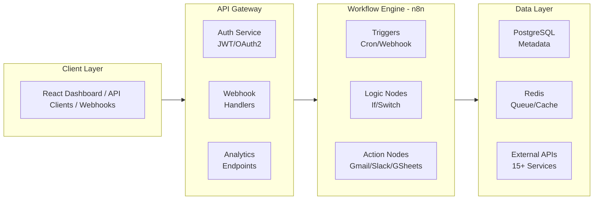

# ⚡ AI Workflow Automation Platform

[](https://python.org)
[](https://fastapi.tiangolo.com)
[](https://n8n.io)
[](https://postgresql.org)
[](https://docker.com)

An enterprise workflow automation hub inspired by Zapier and Make.com, built with **n8n**, **FastAPI**, and **PostgreSQL**. Features intelligent routing, error handling, retry mechanisms, and comprehensive monitoring for 15+ service integrations.

---

## 🌟 Key Features

- **🔧 No-Code Automation Hub** — Visual workflow builder connecting 15+ services (Gmail, Slack, Notion, Google Sheets).
- **🧠 Intelligent Routing** — Conditional logic with branching paths based on data triggers.
- **⚡ Robust Error Handling** — Automatic retry mechanisms with exponential backoff and failure alerts.
- **📊 Real-time Monitoring** — Dashboard for workflow analytics, execution logs, and performance metrics.
- **🔌 Webhook Integration** — HTTP trigger endpoints for external service callbacks.
- **🗄️ Data Persistence** — PostgreSQL storage for workflow states and execution history.
- **🚀 80% Efficiency Gain** — Automated data synchronization reducing manual processing time.

---

## 🏗️ System Architecture



---

## 🚀 Tech Stack

| Layer | Technology |
|---|---|
| Workflow Engine | n8n |
| Backend API | FastAPI (async Python) |
| Database | PostgreSQL |
| Cache / Queue | Redis |
| Authentication | JWT + OAuth2 |
| Deployment | Docker Compose |

---

## 📁 Project Structure

```plaintext
ai-workflow-platform/
├── backend/
│   ├── app/
│   │   ├── api/          # Auth, Webhooks, Workflows, Analytics
│   │   ├── core/         # Config and Database
│   │   └── services/     # Sync and Monitoring logic
│   └── requirements.txt
├── n8n_workflows/        # Pre-built JSON workflow templates
├── docker-compose.yml
├── init-db.sql
└── README.md
```

---

## 🛠️ Setup & Installation

### ✅ Quick Start (Docker) — Recommended

**1. Clone the repository**

```bash
git clone https://github.com/Mohid-Abbas/ai-workflow-platform.git
cd ai-workflow-platform
```

**2. Configure environment**

```bash
cp .env.example .env
# Edit .env with your database and n8n credentials
```

**3. Start all services**

```bash
docker-compose up -d
```

**4. Access services**

| Service | URL |
|---|---|
| FastAPI Docs | http://localhost:8000/docs |
| n8n Editor | http://localhost:5678 |
| Dashboard | http://localhost:8000/dashboard |

---

### 🔧 Manual Setup

**1. Install Python dependencies**

```bash
cd backend
pip install -r requirements.txt
```

**2. Setup PostgreSQL**

```sql
CREATE DATABASE workflow_platform;
CREATE USER admin WITH PASSWORD 'password';
GRANT ALL PRIVILEGES ON DATABASE workflow_platform TO admin;
```

**3. Initialize and run**

```bash
python init_db.py
python -m app.main
```

---

## 🔌 Core Integrations

### Pre-built Workflows

| Workflow | Description |
|---|---|
| 📧 Gmail → Slack | Automatic notifications with 3× retry logic |
| 📝 Notion → Google Sheets | Sync database updates to spreadsheets |
| 🎫 Webhook → Multi-Channel | Route high-priority alerts to SMS/Slack |
| 📊 Scheduled Sync | Hourly cron jobs for PostgreSQL analytics |

---

## 📊 API Endpoints

### Workflow Management

```http
GET    /api/v1/workflows               # List all workflows
POST   /api/v1/workflows               # Create a new workflow
POST   /api/v1/workflows/{id}/execute  # Trigger workflow manually
```

### Analytics & Monitoring

```http
GET    /api/v1/analytics/executions    # Execution history
GET    /api/v1/analytics/metrics       # Success/failure rates
```

---

## 🧠 Error Handling & Reliability

### Retry Mechanism — Exponential Backoff

```python
def execute_with_retry(task, max_retries=3):
    for attempt in range(max_retries):
        try:
            return task.execute()
        except TemporaryError as e:
            wait_time = 2 ** attempt  # 1s → 2s → 4s
            time.sleep(wait_time)
    raise MaxRetriesExceeded(f"Task failed after {max_retries} attempts")
```

All critical workflow nodes support:
- **Automatic retries** with configurable backoff
- **Dead-letter queuing** for failed executions
- **Slack/email alerts** on repeated failures
- **Execution logs** stored in PostgreSQL for audit trails

---

## 📄 License

This project is licensed under the **MIT License** — free to use for educational and commercial purposes.

---

## 👤 Author

**Muhammad Mohid Abbas**  
BSAI Undergraduate @ FAST-NUCES

[](https://linkedin.com)
[](https://github.com/Mohid-Abbas)
